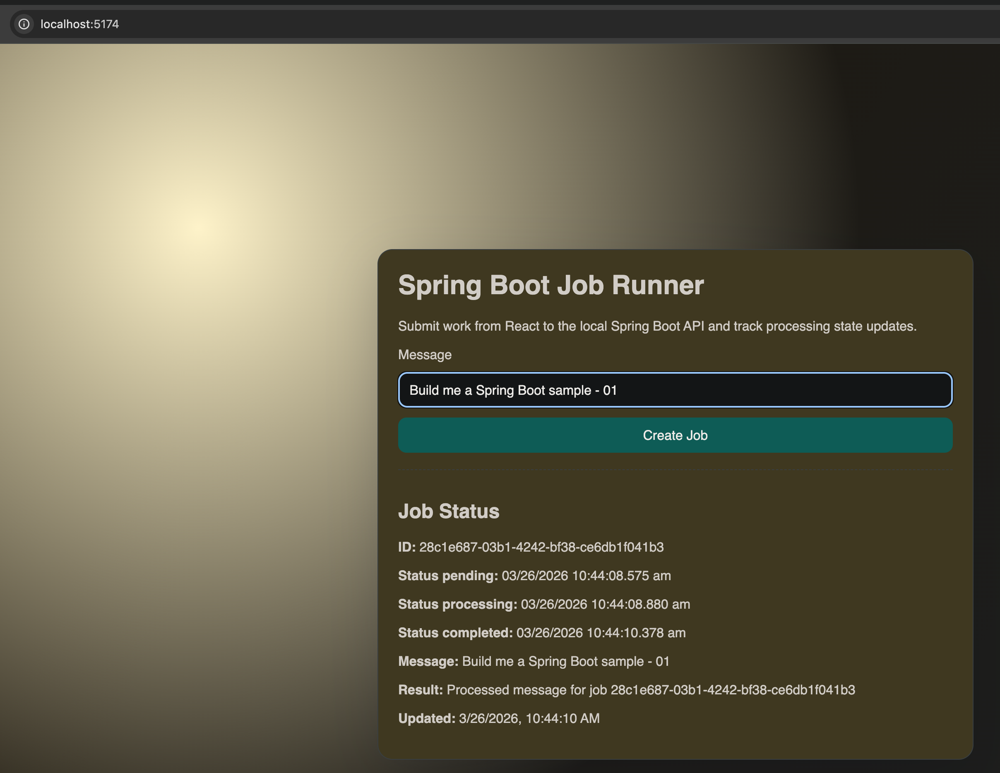

# AWS Spring Boot Fullstack Starter

Starter project with a React UI and a local Spring Boot backend.

## Screenshots

Main UI:



## Structure

- `frontend`: React + TypeScript + Vite UI
- `backend`: Spring Boot API with job endpoints

## Backend API

- `POST /jobs` -> returns `{ jobId, status }` with `202`
- `GET /jobs/{jobId}` -> returns current job state

The backend currently uses in-memory storage and scheduled transitions:

1. `PENDING`
2. `PROCESSING`
3. `COMPLETED`

with timestamps `createdAt`, `processingAt`, and `processedAt`.

## Run locally

Backend:

```bash
cd backend
mvn spring-boot:run
```

Frontend:

```bash
cd frontend
npm install
cp .env.example .env.local
npm run dev
```

## Root scripts

From repo root:

```bash
npm run dev           # frontend
npm run dev:backend   # backend
```

## Next AWS steps

This starter is ready for migration to AWS deployment options such as:

1. ECS Fargate + ALB/API Gateway
2. Spring on Lambda + API Gateway
3. Elastic Beanstalk
